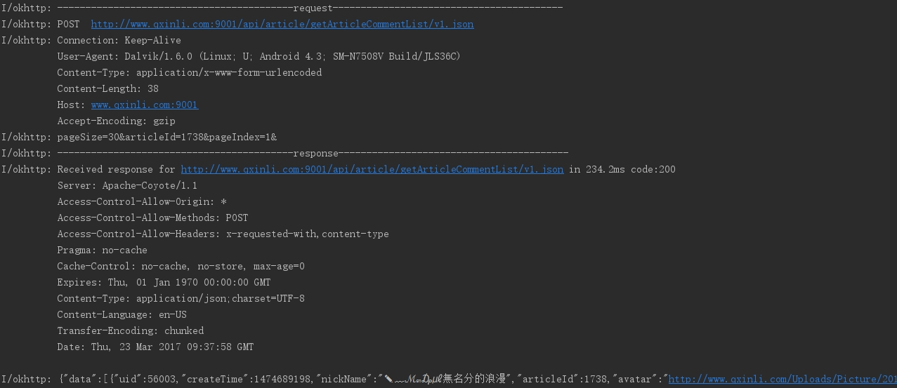

# HttpUtilForAndroid

[](https://jitpack.io/#hss01248/NetWrapper)

## 特点:

第三方隔离:使用过程中不涉及到下一层的库的相关类,全部是

链式调用

不同类型的请求能达到api的隔离

底层提供了okhttp实现

提供默认-全局-单个请求 三个层次的配置功能

提供data-code-msg三个标准字段的json解析和回调,并且可自定义配置三个字段

api设计上结合http协议和android平台特点来实现: 

​	loading对话框,实时进度条显示,文件下载后MD5/SHA1校验,以及打开/扫描到媒体库,或者选择隐藏下载的图片/视频.

loading对话框可在任意界面,任意线程弹出.

六种缓存策略可选,涵盖大多数业务场景.

可设置公共参数和公共headers,并在单个请求中可以选择是否携带这些.


# update

[点击查看更新日志](https://github.com/hss01248/NetWrapper/blob/master/updatelog.md)

[1.0.1的api说明文档](/README_OLD.MD)

# 回调概览

```
前处理
onPreValidate(ConfigInfo config)//额外的参数校验,比如extraTag
onPreExecute()


//成功
onSuccess(T response,String resonseStr,boolean isFromCache)
onSuccessArr(List<T> response, String resonseStr,boolean isFromCache)

onSuccessObj(T response, String responseStr, String data, int code, String msg,boolean isFromCache)
onSuccessArr(List<T> response, String responseStr, String data, int code, String msg,boolean isFromCache)

//失败
onError(String msgCanShow)
onCodeError(String msgCanShow, String hiddenMsg, int code)

onTimeout()//连接超时
onNoNetwork()//没有网络


//业务相关的失败回调
onUnFound()//没有找到对应的内容
onUnlogin()//没有登录或者token过期

//请求被取消
onCancel()


//进度
onProgressChange(long transPortedBytes, long totalBytes)
onFilesUploadProgress(long transPortedBytes, long totalBytes,int fileIndex,int filesCount)

//返回为空
onEmpty()
1.在commonjson中,返回空,"","{}","[]","null"等情况时会走这个回调
2.或者三字段json中,
预期返回为一个jsonArray(即解析后的List<T> response),而实际返回"[]"时,会走此回调

```


# 全局配置

## 入口:

```

HttpUtil.init(getApplicationContext(),"http://www.qxinli.com:9001/api/")
		//此方法返回GlobalConfig类,此类中所有方法均为链式调用
		.xxxx//
		
```

## GlobalConfig类的可配置项目

```
//发送自定义的userAgent搞事情
setUserAgent(String userAgent)
//缓存策略
setCacheMode(@CacheStrategy.Mode int cacheMode)
//cookie管理
setCookieMode(int cookieMode)
//url前缀
setBaseUrl(String url)
//三字段标准json
setStandardJsonKeys(String key_data, String key_code, String key_msg)
setStandardJsonCodes(int codeSuccess,int codeUnlogin,int codeUnfound)
//超时时间
setConnectTimeout(int connectTimeout)
setReadTimeout(int readTimeout)
setWriteTimeout(int writeTimeout)
//重试
setRetryCount(int retryCount)
//https
addCrtificateAssert(String fileName)
//打开log
openLog(String logTag) 

//设置公共header和公共params
addCommonHeader(String key,String value)
addCommonParam(String key,String value)
setAppendCommonHeaders(boolean appendCommonHeaders) 
setAppendCommonParams(boolean appendCommonParams)
//后续可随时更新这些公共参数
updateCommonHeader(String key,String value)
updateCommonParam(String key,String value)

//自动登录的实现
setTokenInfo(String tokenKey, int tokenLocation)//设置token的key,以及token设置在哪里?参数中还是header中还是cookie中
setLoginManager(LoginManager loginManager)//一个接口,实现带回调的自动登录:autoLogin(MyNetListener listener)
updateToken(String token)//后面实时更新token时,调用此api
```

# 几个入口方法

```
public  static <E> StringRequestBuilder<E> requestString(String url) 

public static <E> JsonRequestBuilder<E> requestJson(String url, Class clazz)

public static <E> StandardJsonRequestBuilder<E> reqeustStandardJson(String url, Class<E> clazz)

public static <E> DownloadBuilder<E> download(String url)

public static <E> UploadRequestBuilder<E> upload(String url, String fileDesc, String filePath)
```

# 单个请求的通用配置

## http方法和回调(链式调用的终点)

```
getAsync(MyNetListener<T> listener)
postAsync(MyNetListener<T> listener)
```

## url

> 一般由上方httpUtil的初始化时设置以及入口方法传入.
>
> 如果入口方法中传入的url含有http或者https,则不会拼接初始化设置的baseUrl.

## http请求参数

### 两种设置形式

```
paramsStr(String paramsStr)//将一整个key=value形式或者json形式的字符串设置进来

addParam(String key,String value)//添加参数键值对

addParams(Map<String,String> params)

setAppendCommonParams(boolean appendCommonParams)//本次请求是否携带公共参数
```

### 两种传输形式

> post请求时,在请求体中,可以key=value&key=value的形式传输,也可以json字符串的形式传输

```
setParamsAsJson()//默认为key=value的形式,调用此方法,改成以json形式传输
```


# http头

```
addHeader(String key,String value)
addHeaders(Map<String,String> headers)

setAppendCommonHeaders(boolean appendCommonHeaders)//本次请求是否携带公共headers
```

### 缓存控制(todo)

```
setCacheMode(int cacheMode)
```

取值有:

1. CacheStrategy.NO_CACHE = 1;//不使用缓存,该模式下,cacheKey,cacheTime 参数均无效

2. CacheStrategy.DEFAULT = 2;//完全按照HTTP协议的默认缓存规则，例如有304响应头时缓存。

3. CacheStrategy.REQUEST_FAILED_READ_CACHE = 3;//先请求网络，如果请求网络失败，则读取缓存，如果读取缓存失败，本次请求失败。会导致强制缓存响应.

4. CacheStrategy.IF_NONE_CACHE_REQUEST = 4;//如果缓存不存在才请求网络，否则使用缓存。会导致强制缓存响应

5. CacheStrategy.FIRST_CACHE_THEN_REQUEST = 5;//先使用缓存，不管是否存在，仍然请求网络。会导致强制缓存响应

   注: 分类参考:[okhttp-OkGo](https://github.com/jeasonlzy/okhttp-OkGo)


### cookie管理

```
setCookieMode(int cookieMode) 
```

取值有:

1. GlobalConfig.COOKIE_NONE  不接收cookie
2. GlobalConfig.COOKIE_MEMORY 会话cookie,只保存在内存中(默认值)
3. GlobalConfig.COOKIE_DISK 持久化cookie


## 其他


## https

> 客户端对https的处理有很多策略,目前这里实现了两种,第一种是信任所有证书,第二种是读取客户端预置的证书来通信.

```
setIgnoreCertificateVerify()//设置忽略证书校验
```


## UI: loading对话框

只要传入相关信息,自动帮开发者弹出,关闭.

能在dialog取消时,自动取消对应的网络请求

```
showLoadingDialog()
showLoadingDialog(String loadingMsg)//内置的ProgressDialog
showLoadingDialog(Dialog loadingDialog)//传入自定义的dialog

```

也可以指定activity弹出:
```
showLoadingDialog(Activity activity)
showLoadingDialog(Activity activity,String loadingMsg)

```

注意,如果网络请求在activity的onResume之前发送,那么应该传入activity引用,否则会在前一个activity里弹出.因为引用是在onresume的回调中自动获取的.

内置的dialog特点:

outsideCancelable为false,cancelable为true,也就是点击界面阴影不关闭,点击后退键会关闭

# 分类请求的配置

## 普通字符流请求:StringRequestBuilder

### 构造入口

```
HttpUtil.buildStringRequest(url)
```

### 特殊配置: 无

## 响应为json的请求:

> 自动解析,并在回调中直接返回解析好的javabean

```
HttpUtil.buildJsonRequest("version/latestVersion/v1.json",GetCommonJsonBean.class)
```

示例:

```
HttpUtil.buildJsonRequest("version/latestVersion/v1.json",GetCommonJsonBean.class)
        .showLoadingDialog(MainActivityNew.this,"加载中...")
        .callback(new MyNetListener<GetCommonJsonBean>() {
            @Override
            public void onSuccess(GetCommonJsonBean response, String resonseStr,boolean isFromCache) {
                Logger.json(MyJson.toJsonStr(response));
            }
        })
        .getAsync();
```

### json的解析说明

如果是jsonObject,

clazz传入实体类的Class,同时MyNetListener泛型设置为该实体类

如果JsonArray,:

clazz传入数组元素类的Class,同时MyNetListener泛型设置为该实体类,其回调采用

```
onSuccessArr(List<T> response,String resonseStr)
```


## 响应为三字段标准json的请求:

> 根据用户的配置自动解析三个字段,并回调.三个字段和code的几个取值单个请求没有设置的话,采用全局中的设置.

### json格式类似:

```
{
	"data":xxx,
	"msg":"请求成功!",
	"code":0
}
```

> 其中,三个字段可以通过setStandardJsonKey()方法配置,
>
> 错误码code的几种常见取值(成功,未登录,未找到)也可以配置:setCustomCodeValue()
>
> 支持全局配置和单个请求的配置


### 解析过程为:

> 服务器返回json后,
>
> 先根据定义的code判断成功还是失败
>
> 如果成功,直接将result对应的jsonObject解析成GetStandardJsonBean(下面代码)

```

//返回json后,先根据定义的code判断成功还是失败,
HttpUtil.buildStandardJsonRequest("http://japi.juhe.cn/joke/content/list.from",GetStandardJsonBean.class)
        .addParam("sort","desc")
        .addParam("page","1")
        .addParam("pagesize","4")
        .addParam("time",System.currentTimeMillis()/1000+"")
        .addParam("key","fuck you")
        .setStandardJsonKey("result","error_code","reason")
        .setCustomCodeValue(0,2,-1)
        .showLoadingDialog(MainActivityNew.this,"老司机开车了...")
        .callback(new MyNetListener<GetStandardJsonBean>() {
            @Override
            public void onSuccess(GetStandardJsonBean response, String resonseStr,boolean isFromCache) {
                Logger.json(MyJson.toJsonStr(response));
            }
            @Override
            public void onError(String error) {
                super.onError(error);
                Logger.e(error);
            }
        })
        .getAsync();
```

### 自定义配置

> 当data对应字段预期为jsonobject,而实际为空,空字符串,或者"null","{}"时,是走成功的回调还是失败的回调:
>
> 全局和单个请求均可配置.默认为true,走成功的回调

```
setTreatEmptyDataStrAsSuccess(boolean treatEmptyDataAsSuccess)
```

三个字段的自定义配置,全局和单个请求均可配置:

```
setStandardJsonKeys(String key_data, String key_code, String key_msg)
setStandardJsonCodes(int codeSuccess,int codeUnlogin,int codeUnfound)
```

### 三字段json时,返回错误码为unlogin时,实现自动登录,并在登录成功后自动发送前一个请求

* 首先是GlobalConfig中配置:

setTokenInfo(String tokenKey, int tokenLocation)//设置token的key,以及token设置在哪里?是参数中(0)还是header中(1)还是cookie中(2).如果是cookie中,则cookie管理会自动设置成持久化cookie


setLoginManager(LoginManager loginManager)//一个接口,实现带回调的自动登录:autoLogin(MyNetListener listener)

updateToken(String token)//后面实时更新token时,调用此api

示例:

```
HttpUtil.init(getApplicationContext(),"http://api.qxinli.com:9005/api/")
                .setStandardJsonKeys("data","code","message")
                .setStandardJsonCodes(0,5,2)
                .setTokenInfo("sessionId",0)
               // .addCrtificateRaw(R.raw.srca)
                //.addCrtificateAssert("srca.cer")
                .openLog("okhttp")
                .setLoginManager(new LoginManager() {
                    @Override
                    public void autoLogin(@Nullable final MyNetListener listener) {
        				//注意: 应从sp中读取,加密存取,加密传输.这里的demo省略了这些安全性措施	
                        login("15989366579965", "123456", new MyNetListener<UserInfo>() {
                            @Override
                            public void onSuccess(UserInfo response, String resonseStr, boolean isFromCache) {
                                GlobalConfig.get().updateToken(response.sessionId);//及时更新token
        
                                if(listener!=null)
                                listener.onSuccess(response,resonseStr,isFromCache);
        
                            }
        
                            @Override
                            public void onError(String msgCanShow) {
                                super.onError(msgCanShow);
                                if(listener!=null)
                                listener.onError(msgCanShow);
        
                            }
                        });
        
                    }
                });
```


## 文件下载

### 提供的自定义配置有:

文件的保存路径,默认是download文件夹下

下载完成后是否校验md5或者sha1,默认不校验,如果校验不成功,则表示下载失败

下载成功后,是否打开文件(不用关系文件类型,内部已经判断,并调用系统intent去打开)

下载成功后,是否通知媒体库(比如下载的图片,音视频,想立即让用户可以在系统相册中看到,就需要通知),默认是通知的

下载成功后,是否隐藏该文件,让系统媒体库扫描不到.(通过在文件所在的文件夹下建立一个名为.nomedia的空文件来实现)

### 对话框特点: 

通过showLoadingDialog弹出的自带下载进度显示,无需开发者再操作.

默认是直线进度条

可以选择是圆圈型的还是直线型的,可采用下面的方法配置

```
 showLoadingDialog( String loadingMsg, boolean updateProgress, boolean horizontal)
```

> 暂不实现多线程下载,断点续传等功能

### 示例

```
HttpUtil.buildDownloadRequest(url2)
        .showLoadingDialog(MainActivityNew.this)//显示下载进度dialog
        .savedPath(path)//自定义保存路径
        .setOpenAfterSuccess()//下载完成后打开
        .setHideFile()//隐藏该文件
        .setNotifyMediaCenter(true)//通知媒体库
        .verifyMd5("djso8d89dsjd9s7dsfj")//下载完后校验md5
        .getAsync(new MyNetListener() {
            @Override
            public void onSuccess(Object response, String onSuccess,boolean isFromCache) {
                Logger.e("onSuccess:"+onSuccess);
            }

            @Override
            public void onProgressChange(long fileSize, long downloadedSize) {
                super.onProgressChange(fileSize, downloadedSize);
                Logger.e("progress:"+downloadedSize+"--filesize:"+fileSize);
            }

            @Override
            public void onError(String msgCanShow) {
                super.onError(msgCanShow);
                Logger.e(msgCanShow);
            }
        });
```

## 文件上传

> 支持多文件上传的进度回调
>
> 暂不实现多线程上传/分片上传/断点续传等高级功能

### 对话框的进度说明

对于开发者来说,也是带进度的对话框,情况和下载的一样.

### 示例

```
HttpUtil.buildUpLoadRequest("http://192.168.1.100:8080/gm/file/q_uploadAndroidApk.do","uploadFile1","/storage/emulated/0/qxinli.apk")//入口方法中至少添加一个文件
        .addFile("uploadFile2","/storage/emulated/0/Download/retrofit/qxinli-2.apk")//添加文件的方法
        .addParam("uploadFile555","1474363536041.jpg")
        .addParam("api_secret777","898767hjk")
        .showLoadingDialog(this)
        .postAsync(new MyNetListener<String>() {
                            @Override
                            public void onSuccess(String response, String resonseStr) {
                                Logger.e(resonseStr);
                            }

                            @Override
                            public void onError(String error) {
                                super.onError(error);
                                Logger.e("error:"+error);
                            }

                            @Override
                            public void onProgressChange(long downloadedSize, long fileSize) {
                                super.onProgressChange(fileSize, downloadedSize);
                                Logger.e("upload onProgressChange:"+downloadedSize + "  total:"+ fileSize +"  progress:"+downloadedSize*100/fileSize);
                            }
                        });
```


# 请求的取消

> 请求的取消能够立即关闭socket,立即回调到onCancel()中,只要在activity/fragment销毁时调用,就可以避免网络请求导致的内存泄漏.

## 取消单个请求

### 通过tag取消

> 最佳实践: 在activity的onDestory方法中取消该activity中的相关请求

```
HttpUtil.cancelRquest(tag);
```

### 通过dialog取消

如果弹出dialog,那么不管有没有设置tag,只要取消dialog(后退键),就能取消该网络请求.

## 取消所有请求

HttpUtil.cancleAllRequest()
## 日志打印效果

默认关闭日志,在GlobalConfig的openLog(String logTag) 打开.

能够将请求和响应的全部内容都打印出来.

如果是上传下载的大数据量,或者gzip压缩,则相应的请求体或者响应体不打印.

 


# usage

## gradle

Step 1. Add the JitPack repository to your build file

Add it in your root build.gradle at the end of repositories:

```
allprojects {
    repositories {
       
        maven { url "https://jitpack.io" }
    }
}
```

Step 2. Add the dependency

```java
dependencies {
        compile 'com.github.hss01248:HttpUtilForAndroid:2.1.4'
}
```


